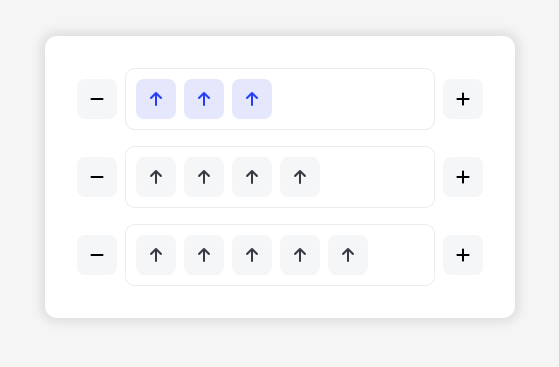

# UpVotes



This project is a React + TypeScript application implementing upvote button lists with global state, local persistence, and automated tests.

## Overview
- **React + TypeScript**
- **Global state management** with Context API
- **Persistence** in localStorage
- **Styling** with simple CSS
- **SVGs as React components** (via vite-plugin-svgr)
- **Testing** with Vitest and Testing Library

---

## Installation

**Install dependencies:**
   ```bash
   npm install
   ```
---

## Scripts

- `npm run dev` — run the app in development mode
- `npm run build` — production build
- `npm run preview` — preview the production build
- `npm run test` — run tests with Vitest

---

## Component Structure

- `src/components/UpVote.tsx` — Upvote button, receives state via props
- `src/components/UpVoteList.tsx` — List of upvotes, with add/remove buttons
- `src/UpVoteContext.tsx` — Global context for managing multiple lists
- `src/assets/icons/` — SVGs used as React components

---

## Styling
- The project uses simple CSS for component styling.
- You can find and edit styles in the relevant `.css` files in the `src/components` directory or alongside each component.
- Custom class names are used for layout and button appearance.

---

## SVG as React Component
- SVGs are imported as components using the `vite-plugin-svgr` plugin:
  ```tsx
  import PlusIcon from '@/assets/icons/plus.svg?react';
  <PlusIcon width={16} height={16} />
  ```

---

## Testing
- Tests are written in TypeScript and use only native Vitest/Chai and Testing Library matchers.
- To run:
  ```bash
  npm run test
  ```
- Tests cover:
  - Button rendering and interaction
  - Adding/removing upvotes
  - Global context functionality

---

## Disclaimers

- The decision to include a button for removing upvotes was made intentionally, even though it was not specified in the original test description. This was added to enhance usability and flexibility for the user.

- This project was developed using **VS Code** with **GitHub Copilot**. This is the workflow I currently use in my projects to maximize productivity and code quality.
